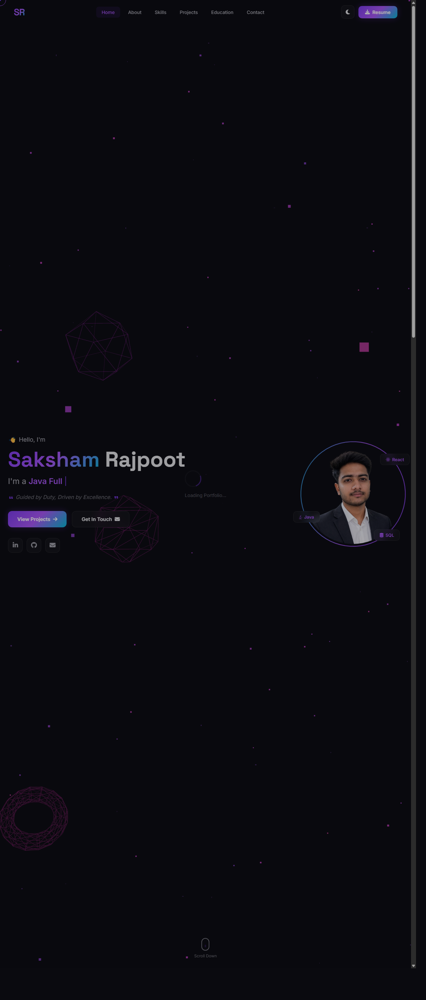

# Saksham Rajpoot | Full Stack Web Developer Portfolio


Welcome to the repository for my personal portfolio website. This project showcases my skills, projects, education, and professional experience as an aspiring Software Developer specializing in Java Full Stack Web Development.

## 🌟 Features

- **Immersive 3D Background**: Utilizes Three.js for an interactive and visually appealing background.
- **Modern UI/UX**: Designed with modern aesthetics, featuring glassmorphism, smooth scroll animations, and a custom interactive cursor.
- **Fully Responsive**: Optimized for all devices, from mobile phones to large desktop screens, with a dedicated mobile menu.
- **Theme Toggling**: Includes a smooth dark/light mode toggle for better user accessibility and preference.
- **Dynamic Sections**: Features dedicated sections for About, Skills, Projects, Education, and a Contact form.

## 🚀 Live Demo
[Insert Link to your Live Portfolio here, e.g., GitHub Pages]

## 📸 Screenshots

*(Note: Please create an `assets` folder in your repository, take screenshots of your webpage, and replace these placeholder image paths with your actual screenshots to display them here.)*

### Home Section


### Projects Section


### Contact Section


## 🛠️ Technologies Used

**Frontend:**
- HTML5
- CSS3 (Vanilla CSS, custom properties, animations)
- JavaScript (ES6+)
- Three.js (For 3D background particle effects)

**Icons & Fonts:**
- FontAwesome (Icons)
- Google Fonts (Inter, Space Grotesk, JetBrains Mono)

## 📂 Project Structure

```text
├── index.html       # Main HTML document
├── base.css         # Global styles and CSS variables
├── layout.css       # Layout styles (Navbar, Footer, Grids)
├── sections.css     # Styles for specific sections (Hero, About, Projects)
├── styles.css       # Main stylesheet that imports other CSS files
├── app.js           # JavaScript logic (Three.js setup, animations, UI interactions)
└── README.md        # Project documentation
```

## ⚙️ Getting Started

To run this project locally:

1. Clone the repository:
   ```bash
   git clone https://github.com/SakshamRajpoot10/portfolio.git
   ```
2. Navigate to the project directory:
   ```bash
   cd portfolio
   ```
3. Open `index.html` in your browser. For the best experience (especially for running Three.js without cross-origin issues), it is recommended to use a local development server like the "Live Server" extension in VS Code.

## 📫 Contact

- **Email:** sakshamrajpoot094@gmail.com
- **LinkedIn:** [Saksham Rajpoot](https://www.linkedin.com/in/saksham-rajpoot-38043624b)
- **GitHub:** [SakshamRajpoot10](https://github.com/SakshamRajpoot10)

---
*Crafted with ❤️ by Saksham Rajpoot*
